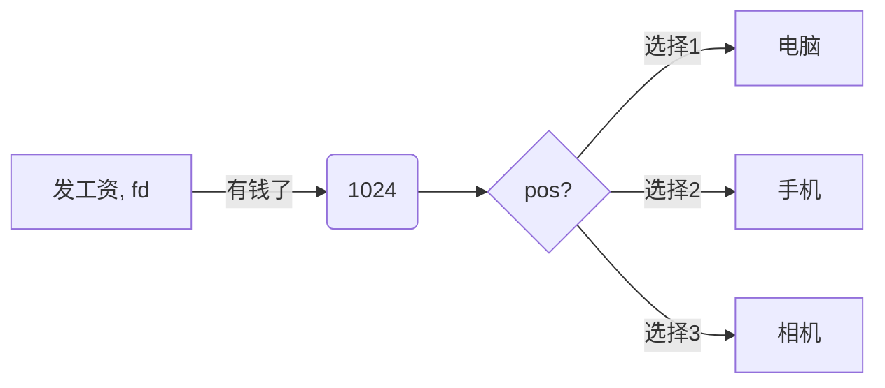

# 1-库函数

优先使用标准IO(方便移植)   man 7，讲机制

errno  : /usr/include/asm-generic

## 1.1 fopen

```c
FILE *fopen(const char *pathname, const char *mode);
// linux下mode不需要加b，都是stream
// fopen("tmp", "readwrite")，不会报错，只会读begin of str，后面忽略
```

小面试题

```c
char* ptr = "abc";
ptr[0] = 'x';   // ptr不能改变常量(在某些window平台能够编译)
```


```c
#include <stdio.h>
#include <stdlib.h>
#include <errno.h>
int main() {
    FILE* fp;
    fp = fopen("tmp", "r"); // r, r+必须文件存在
    if (fp == NULL) {
        rintf(stderr, "fopen failed errno=%d %s\n", errno,strerror(errno));
        perror("fopen()"); // 自动关联全部变量errno
        exit(1);
    }
    puts("OK!");
    fclose(fp);
    return 0;
}
```


```c
// 返回值在 堆？ 栈？ 还是静态区？
FILE *fopen(const char *pathname, const char *mode);

1栈
返回局部变量地址 
2静态区
只能有一个实例
3堆 (malloc)
fclose 对应 free  如果是一对函数fclose,fopen, open, close,则是在堆区，othersize都有可能
```


## 1.2 fclose

```c
int fclose(FILE *stream);
```


test一个进程能打开多少文件？

```c
#include <stdio.h>
#include <stdlib.h>
#include <errno.h>
#include <string.h>
int main() {
    FILE* fp;
    int count = 0;
    while (1) {
        fp = fopen("tmp", "r");
        if (fp == NULL) {

            perror("fopen()");
            break;
        }
        else {
            count++;
        }
    }
    printf("count %d\n", count);
    return 0;
}
// fopen(): Too many open files
// count 1021
// 因为操作系统默认打开了三个流 stdin stdout stderr
// ulimit -a 查看
// 0666 & ~umask  创建一个文件默认权限 umask是一个命令
```


## 1.3 fgetc和fputc

实现cp命令

```c
#include <stdio.h>
#include <stdlib.h>
#include <errno.h>
#include <string.h>
int main(int argc, char* argv[]) {
    FILE *fps, *fpd;
    int ch;
    fps = fopen(argv[1], "r");
    if (fps == NULL) {
        perror("fopen()");
        exit(1);
    }

    fpd = fopen(argv[2], "w");
    if (fpd == NULL) {
        perror("fopen()");
        fclose(fpd); // 垃圾， 钩子函数？
        exit(1);
    }
    while(1) {
        ch = fgetc(fps);
        if (ch == EOF)
            break;
        fputc(ch, fpd);
    }

    fclose(fpd);
    fclose(fps);
    return 0;
}
/* 
./a.out /etc/services /tmp/out
diff /etc/services /tmp/out 没有输出，则两个文件一样
*/
```


测试一个文件有多少有效字符

```c
#include <stdio.h>
#include <stdlib.h>
#include <errno.h>
#include <string.h>
int main(int argc, char* argv[]) {
    FILE *fp;
    int count = 0;
    if (argc < 2) {
        fprintf(stderr, "Usage..\n");
        exit(1);
    }
    fp = fopen(argv[1], "r");
    if (fp == NULL) {
        perror("fopen");
        exit(1);
    }
    while (fgetc(fp) != EOF) {
        count++;
    }
    printf("count = %d\n", count);
    return 0;
}
// 文件过长int溢出
```


## 1.4 fgets和fputs

gets不要用，不检查返回值溢出

```c
char *fgets(char *s, int size, FILE *stream);

size-1
'\n'

abcdefg -> abcd\0
ab     -> ab\n\0
abcd   -> abcd\0  第一次读 -> \n\0...   第二次读   
    
int fputs(const char *s, FILE *stream);
```


用fgets和fputs实现cp

```c
#include <stdio.h>
#include <stdlib.h>
#include <errno.h>
#include <string.h>
int main(int argc, char* argv[]) {
    FILE *fps, *fpd;
    char buf[BUFSIZ];
    fps = fopen(argv[1], "r");
    if (fps == NULL) {
        perror("fopen()");
        exit(1);
    }

    fpd = fopen(argv[2], "w");
    if (fpd == NULL) {
        perror("fopen()");
        fclose(fpd); // 垃圾， 钩子函数？
        exit(1);
    }
    while (fgets(buf, BUFSIZ, fps) != NULL) {
        fputs(buf, fpd);
    }

    fclose(fpd);
    fclose(fps);
    return 0;
}
/*
./a.out /etc/services /tmp/out
diff /etc/services /tmp/out 没有输出，则两个文件一样
*/
```


## 1.5 fwrite和fread

```c
size_t fread(void *ptr, size_t size, size_t nmemb, FILE *stream);
// size一个对象多大， nmemb：多少个对象
1 -> 数据量足够       当fgetc和fputs来用
2 -> 只有五个字节
    fread(buf, 1, 10, fp);
1 -> 10 -> 10字节
2 -> 5  -> 5字节
    fread(buf, 10, 1, fp);
1 -> 1  -> 10字节
2 -> 0  -> ???? 
    
size_t fwrite(const void *ptr, size_t size, size_t nmemb,
                     FILE *stream);
```


再次实现cp。。。

```c
#include <stdio.h>
#include <stdlib.h>
#include <errno.h>
#include <string.h>
int main(int argc, char* argv[]) {
    FILE *fps, *fpd;
    char buf[BUFSIZ];
    int n;
    fps = fopen(argv[1], "r");
    if (fps == NULL) {
        perror("fopen()");
        exit(1);
    }

    fpd = fopen(argv[2], "w");
    if (fpd == NULL) {
        perror("fopen()");
        fclose(fpd); // 垃圾， 钩子函数？
        exit(1);
    }
    while ((n = fread(buf, 1, BUFSIZ, fps)) > 0) {
        fwrite(buf, 1, n, fpd);
    }

    fclose(fpd);
    fclose(fps);
    return 0;
}
/*
./a.out /etc/services /tmp/out
diff /etc/services /tmp/out 没有输出，则两个文件一样
*/
```


## 1.6 printf和scanf

```c
int printf(const char *format, ...);
int fprintf(FILE *stream, const char *format, ...);
int dprintf(int fd, const char *format, ...);
int sprintf(char *str, const char *format, ...);
int snprintf(char *str, size_t size, const char *format, ...);
n是防止越界

int scanf(const char *format, ...);
int sscanf(const char *str, const char *format, ...);
```

格式化输出

```c
#include <stdio.h>
#include <stdlib.h>
#include <errno.h>
#include <string.h>
int main(int argc, char* argv[]) {
    char buf[BUFSIZ];
    int year = 2014, month = 5, day = 13;
    sprintf(buf, "%d-%d-%d", year, month, day); // atoi反函数
    puts(buf);
    return 0;
}
```


## 1.7 fseek， ftell，rewind

```c
int fseek(FILE *stream, long offset, int whence);
文件首 fseek(fp, 0, SEEK_SET)
    
long ftell(FILE *stream);
告诉文件指针当前位置
void rewind(FILE *stream); (void) fseek(stream, 0L, SEEK_SET);
```


再次判断文件有效长度

```c
#include <stdio.h>
#include <stdlib.h>
#include <errno.h>
#include <string.h>
int main(int argc, char* argv[]) {
    FILE *fp;
    if (argc < 2) {
        printf("Usage error");
        exit(1);
    }
    fp = fopen(argv[1], "r");
    if (fp == NULL) {
        perror("fopen()");
        exit(1);
    }
    fseek(fp, 0, SEEK_END);
    printf("%ld\n", ftell(fp));
    return 0;
}
```


**C语言缓冲模式**

```c
// int fflush(FILE *stream);
/*
缓冲区的作用： 大多数情况是好事，合并系统调用
行缓冲： 换行时候刷新， 满了刷新，强制刷新(标准输出是这样，因为是终端设备)
全缓冲：满了刷新，强制刷新（默认， 只要不是终端设备）
无缓冲：如stderr，需要立即输出的内容
int setvbuf(FILE *stream, char *buf, int mode, size_t size);
基本用不到，垃圾函数
*/
#include <stdio.h>
#include <stdlib.h>
#include <errno.h>
#include <string.h>
int main(int argc, char* argv[]) {
    printf("before"); //不打印，标准终端是行缓冲模式，换行或者一行满了刷新
    while (1);
    printf("after");
    return 0;
}
```

fseeko和ftello， 原来两个不能用到超过2g的文件 但是兼容性不好，不能c89，99

## 1.8 补充

**获得一整行**  自己实现getline？

```c
ssize_t getline(char **lineptr, size_t *n, FILE *stream);

ssize_t getdelim(char **lineptr, size_t *n, int delim, FILE *stream);
```

```c
#include <stdio.h>
#include <stdlib.h>
#include <errno.h>
#include <string.h>
int main(int argc, char* argv[]) {
    FILE *fp;
    char *linebuf;
    size_t len;
    if (argc < 2) {
        fprintf(stderr, "Usage..\n");
        exit(1);
    }
    fp = fopen(argv[1], "r");
    if (fp == NULL)  {
        perror("fopen()");
        exit(1);
    }
    // !!!!!!!!!!!
    linebuf = nullptr;
    len = 0;
    while (1) {
        if(getline(&linebuf, &len, fp) < 0)
            break;
        printf("%d\n", strlen(linebuf));
        printf("%d\n", len);
    }

    fclose(fp);
    return 0;
}
```

**临时文件**

1如何不冲突(多任务，多进程可以用同个文件)

2及时销毁

```c
char *tmpnam(char *s);
// 不是原子操作，别人可能同时open(w,a)
FILE *tmpfile(void);
// a unique temporary file,匿名文件没有名字，自动销毁
```


# 2-系统调用IO

buffer是输出的，cache是输入的？




## 2-1 open和close

```C
#include <unistd.h>
int open(const char *pathname, int flags); //c没有函数重载，是变参函数
int open(const char *pathname, int flags, mode_t mode);//有O_CREAT，用这个函数
//如何判断是函数重载还是变参？ 传入多个参数，报错是重载，警告是变参
int close(int fd);
```


## 2-2 read，write，lseek

```c
#include <unistd.h>
ssize_t read(int fd, void *buf, size_t count);
ssize_t write(int fd, const void *buf, size_t count);

#include <sys/types.h>
off_t lseek(int fd, off_t offset, int whence);
```


实现cp喽

```c
#include <stdio.h>
#include <stdlib.h>
#include <errno.h>
#include <string.h>
#include <unistd.h>
#include <sys/types.h>
#include <fcntl.h>
int main(int argc, char* argv[]) {
    int sfd, dfd, len, ret, pos;
    char buf[BUFSIZ];
    if (argc < 3) {
        fprintf(stderr, "Usage..\n");
        exit(1);
    }
    sfd = open(argv[1], O_RDONLY);
    if (sfd < 0) {
        perror("open()sdf");
        exit(1);
    }
    dfd = open(argv[2], O_WRONLY|O_CREAT|O_TRUNC, 0666);
    if (dfd < 0) {
        perror("open()dfd");
        fprintf(stderr, strerror(dfd));
        exit(1);
    }
    while (1) {
        len = read(sfd, buf, BUFSIZ);
        if (len < 0) {
            perror("read");
            break;
        }
        if (len == 0)
            break;
        pos = 0;
        while (len > 0) {
            ret = write(dfd, buf + pos, len);
            if (ret < 0) {
                perror("write()");
                exit(1);
            }
            pos += ret;
            len -= ret;
        }
    }
    close(dfd);
    close(sfd);
    return 0;
}
```


## 2-3 两者比较

文件IO和标准IO的区别

举例： 传达室老大爷跑邮局

来一个人要送信就马上去送，or每次来20封才去，来第五封信的时候特别重要，800里加急，刷新缓冲区

区别：响应速度快(响应速度快) & 吞吐量大(标准io)

面试：如何使一个程序变快？

标准IO和文件IO不可混用

```c
#include <stdio.h>
#include <stdlib.h>
#include <errno.h>
#include <string.h>
#include <unistd.h>
#include <sys/types.h>
#include <fcntl.h>
int main(int argc, char* argv[]) {
    putchar('a');
    write(1, "b", 1);

    putchar('a');
    write(1, "b", 1);

    putchar('a');
    write(1, "b", 1);
    return 0;
}
/* 
bbbaaa
strace ./a.out 
write(1, "b", 1b)                        = 1
write(1, "b", 1b)                        = 1
write(1, "b", 1b)                        = 1
write(1, "aaa", 3aaa)                      = 3
*/
```


IO效率问题，更改BUFSIZE一直放到，查看进程效率时间(time命令)

## 2-4文件共享

面试：删除一个文件的第十行。(truncate)


## 2-5 dup和原子操作

原子操作：不可分割的最小单位，作用：解决竞争和冲突

```c
#include <unistd.h>
int dup(int oldfd);
int dup2(int oldfd, int newfd);
```

```c
#include <stdio.h>
#include <stdlib.h>
#include <errno.h>
#include <string.h>
#include <unistd.h>
#include <sys/types.h>
#include <fcntl.h>
#define FNAME "/tmp/out"
int main(int argc, char* argv[]) {
    int fd;
    int tmp = dup(1);
    fd = open(argv[1], O_WRONLY|O_TRUNC|O_CREAT, 0600);
    printf("%d\n", fd);
    if (fd < 0) {
        perror("open()");
        exit(1);
    }

//    close(1); 非原子操作
//    dup(fd);
    dup2(fd, 1); //fd和1一样，什么都不做
    if (fd != 1)
        close(fd);

    puts("hello");
//还原终端
    dup2(tmp, 1);
    puts("world");
    return 0;
}
```


## 2-6 fcntl和ioctl

/dev/fd 虚目录，显示的是当前进程的文件描述符信息


# 3-文件系统介绍

touch -- -a  (建立-a的文件，任何命令接--后面空格接参数都是表示非解析参数)

mkdir -- -haha


## 3-1 stat

```c
#include <sys/types.h>
#include <sys/stat.h>
#include <unistd.h>
int stat(const char *pathname, struct stat *statbuf);
int fstat(int fd, struct stat *statbuf);
int lstat(const char *pathname, struct stat *statbuf);
```

查看文件大小

```c
#include <stdio.h>
#include <stdlib.h>
#include <errno.h>
#include <string.h>
#include <unistd.h>
#include <sys/stat.h>
#include <sys/types.h>
#include <fcntl.h>

static int flen(const char  *fname) {
    struct stat statres;
    if (stat(fname, &statres) < 0) {
        perror("stat");
        exit(1);
    }
    return statres.st_size;
}
int main(int argc, char* argv[]) {

    if (argc < 2) {
        fprintf(stderr, "Usage\n");
        exit(1);
    }

    printf("%d\n", flen(argv[1]));
    return 0;
}
```


## 3-2 空洞文件

```c
#include <stdio.h>
#include <stdlib.h>
#include <errno.h>
#include <string.h>
#include <unistd.h>
#include <sys/stat.h>
#include <sys/types.h>
#include <fcntl.h>

static int flen(const char  *fname) {
    struct stat statres;
    if (stat(fname, &statres) < 0) {
        perror("stat");
        exit(1);
    }
    return statres.st_size;
}
int main(int argc, char* argv[]) {
    int fd;
    if (argc < 2) {
        fprintf(stderr, "Usage...\n");
        exit(1);
    }
    fd = open(argv[1], O_WRONLY|O_CREAT|O_TRUNC, 0600);
    if (fd < 0) {
        perror("open()");
        exit(1);
    }
    lseek(fd, 5LL*1024LL*1024LL*1024LL-1LL, SEEK_SET);
    write(fd, "", 1);
    close(fd);
    printf("%d\n", flen(argv[1]));
    return 0;
}
// stat查看和ls -l不一样 statres.st_size只是一个属性值，并不是实际大小和wins不一样
```


## 3-3 文件属性

```c
#include <stdio.h>
#include <stdlib.h>
#include <errno.h>
#include <string.h>
#include <unistd.h>
#include <sys/stat.h>
#include <sys/types.h>
#include <fcntl.h>

static int ftype(const char  *fname) {
    struct stat statres;
    if (stat(fname, &statres) < 0) {
        perror("stat");
        exit(1);
    }
    if (S_ISREG(statres.st_mode))
        return '-';
    else if (S_ISDIR(statres.st_mode))
        return 'd';
    else if (S_ISSOCK(statres.st_mode))
        return 's';
    return '?';
}
int main(int argc, char* argv[]) {
    int fd;
    if (argc < 2) {
        fprintf(stderr, "Usage...\n");
        exit(1);
    }

    printf("%c\n", ftype(argv[1]));
    return 0;
}
```

```c
#include <sys/types.h>
#include <sys/stat.h>
mode_t umask(mode_t mask);
int chmod(const char *pathname, mode_t mode);
int fchmod(int fd, mode_t mode);
```

```bash
#沾住位 t位
ls -l /     #tmp目录文件属性最后一位是t
```


## 3-4 FAT系统


## 3-5 UFS文件系统解析


## 3-6 链接文件和目录操作

```c
int unlink(const char *pathname);
int link(const char *oldpath, const char *newpath);
int remove(const char *pathname);
int rename(const char *oldpath, const char *newpath);
int utime(const char *filename, const struct utimbuf *times);
int mkdir(const char *pathname, mode_t mode);
int rmdir(const char *pathname);
int chdir(const char *path);
int fchdir(int fd);
```


## 3-7 分析目录/读取目录

```c
int glob(const char *pattern, int flags,
                int (*errfunc) (const char *epath, int eerrno),
                glob_t *pglob); // 解析模式/通配符
void globfree(glob_t *pglob);
```


```c++
#include <stdio.h>
#include <stdlib.h>
#include <glob.h>
#include <fcntl.h>
#include <string.h>

#define PAT "/etc/*"
int errfunc(const char* path, int errno) {
    puts(path);
    fprintf(stderr, "ERRoOR %s:", strerror(errno));
    return 0;
}
int main(int argc, char* argv[]) {
    if (argc < 2) {
        fprintf(stderr, "Usage...\n");
        exit(1);
    }
    glob_t globres;
    int err;
    err = glob(PAT, 0, NULL, &globres);
    if (err) {
        printf("ERROR code: %d\n", err);
        exit(1);
    }
    for (int i = 0; i < globres.gl_pathc; i++) {
        puts(globres.gl_pathv[i]);
    }
    globfree(&globres);
    return 0;
}
```


使用系统调用打开

```c
#include <stdio.h>
#include <stdlib.h>
#include <glob.h>
#include <fcntl.h>
#include <string.h>
#include <sys/types.h>
#include <dirent.h>

#define PAT "/etc"
int errfunc(const char* path, int errno) {
    puts(path);
    fprintf(stderr, "ERRoOR %s:", strerror(errno));
    return 0;
}
int main(int argc, char* argv[]) {
    if (argc < 2) {
        fprintf(stderr, "Usage...\n");
        exit(1);
    }
    DIR *dp;
    struct dirent *cur;
    dp = opendir(PAT);
    if (dp == NULL) {
        perror("opendir error");
        exit(1);
    }
    while ((cur = readdir(dp)) != NULL) {
        puts(cur->d_name);
    }
    closedir(dp);
    return 0;
}
```


**实现du**

```c
#include <stdio.h>
#include <stdlib.h>
#include <glob.h>
#include <fcntl.h>
#include <string.h>
#include <sys/types.h>
#include <sys/stat.h>
#include <dirent.h>

#define PAT "/etc"
static bool path_noloop(const char* path) {
    const char *pos;
    pos = strrchr(path, '/');
    if (pos == NULL)
        exit(1);
    if (strcmp(pos+1, ".") == 0 || strcmp(pos+1, "..") == 0)
        return 0;
    return 1;
}
static int64_t mydu(const char* path) {
    struct stat statres;
    int64_t sum;
    glob_t globres;
    char nextpath[BUFSIZ];
    if (lstat(path, &statres) < 0) {
        perror("lstat()");
        exit(1);
    }

    if (!S_ISDIR(statres.st_mode)) {
        return statres.st_blocks / 2;
    }
    strncpy(nextpath, path, BUFSIZ);
    strncat(nextpath, "/*", BUFSIZ);
    glob(nextpath, 0, NULL, &globres);


    strncpy(nextpath, path, BUFSIZ);
    strncat(nextpath, "/.*", BUFSIZ);
    glob(nextpath, GLOB_APPEND, NULL, &globres);

    sum = 0;
    for (int i = 0; i < globres.gl_pathc; i++) {
        if (path_noloop(globres.gl_pathv[i]))
        sum += mydu(globres.gl_pathv[i]);
    }
    sum += statres.st_blocks;
    return sum / 2;
}
int main(int argc, char* argv[]) {
    if (argc < 2) {
        fprintf(stderr, "Usage...\n");
        exit(1);
    }
    printf("%lld", mydu(argv[1]));
    return 0;
}
```


## 3-8 系统数据文件和信息

/etc/passwd  （不一定每个系统都有）

```c
#include <sys/types.h>
#include <pwd.h>
struct passwd *getpwnam(const char *name);
struct passwd *getpwuid(uid_t uid);
```

根据用户id查询用户信息

```c
#include <stdio.h>
#include <stdlib.h>
#include <glob.h>
#include <fcntl.h>
#include <string.h>
#include <sys/types.h>
#include <pwd.h>

int main(int argc, char* argv[]) {
    struct passwd *pwdline;
    if (argc < 2) {
        fprintf(stderr, "Usage...\n");
        exit(1);
    }
    pwdline = getpwuid(atoi(argv[1]));
    puts(pwdline->pw_name);
    return 0;
}
```


/etc/group 

```c
#include <sys/types.h>
#include <grp.h>
struct group *getgrnam(const char *name);
struct group *getgrgid(gid_t gid);
```


/etc/shadow

hash  混淆

加密 -> 解密

```c
#include <shadow.h>
struct spwd *getspnam(const char *name);
struct spwd *getspent(void);

#include <crypt.h>
char *crypt(const char *phrase, const char *setting);
```

```c
#include <stdio.h>
#include <stdlib.h>
#include <glob.h>
#include <fcntl.h>
#include <string.h>
#include <sys/types.h>
#include <pwd.h>
#include <unistd.h>
#include <shadow.h>
#include <crypt.h>
int main(int argc, char* argv[]) {
    char* input_pass;
    struct spwd* shadowline;
    char* re;
    if (argc < 2) {
        fprintf(stderr, "Usage...\n");
        exit(1);
    }
    input_pass = getpass("PassWord:");

    shadowline = getspnam(argv[1]);
    re = crypt(input_pass, shadowline->sp_pwdp);
    if (strcmp(shadowline->sp_pwdp, re) == 0) {
        puts("ok!");
    }
    else
        puts("failed!");
    return 0;
}
// 需要root用户，不然没有查看权限， -lcrypt
```


## 3-9 时间戳

```c
// time_t char* struct tm
time();
gtime();
localtime();
mktime();
strftime();
```

```c
#include <stdio.h>
#include <stdlib.h>
#include <time.h>
#include <fcntl.h>
#include <string.h>
#include <sys/types.h>
#include <unistd.h>

#define FNAME "/tmp/out"
int main(int argc, char* argv[]) {
    FILE *fp;
    int count = 0;
    char buf[BUFSIZ];
    struct tm *tm;
    time_t stamp;
    if (argc < 2) {
        fprintf(stderr, "Usage...\n");
        exit(1);
    }
    fp = fopen(FNAME, "a+");
    if (fp == NULL) {
        perror("fopen()");
        exit(1);
    }

    while (fgets(buf, BUFSIZ, fp) != NULL) {
        count++;
    }
    printf("row %d\n", count);
    while (1) {
        time(&stamp);
        tm = localtime(&stamp); // year是从1900开始,month是0-11
        fprintf(fp, "%-4d%d-%d-%d %d:%d:%d\n", ++count,
                tm->tm_year + 1900, tm->tm_mon + 1, tm->tm_mday,
                tm->tm_hour, tm->tm_min, tm->tm_sec);
        fflush(fp);  //非终端设备是全缓冲，\n不会刷新缓冲区
        sleep(1);
    }

    fclose(fp);
    return 0;
}
```


100天以后。。。

```c
#include <stdio.h>
#include <stdlib.h>
#include <time.h>
#include <fcntl.h>
#include <string.h>
#include <sys/types.h>
#include <unistd.h>

#define FNAME "/tmp/out"
int main(int argc, char* argv[]) {
    time_t stamp;
    struct tm *tm;
    char buf[BUFSIZ];

    stamp = time(NULL);
    tm = localtime(&stamp);
    strftime(buf, BUFSIZ, "Now:%Y-%m-%d", tm);
    puts(buf);
    if (argc < 2) {
        fprintf(stderr, "Usage...\n");
        exit(1);
    }

    tm->tm_mday += 100;
    (void)mktime(tm);
    strftime(buf, BUFSIZ, "100 days later:%Y-%m-%d", tm);
    puts(buf);

    return 0;
}
```


## 3-10 进程环境

main函数

​	int main(int argc, char* argv[])

进程的终止

​	正常终止：

​			从main返回  进程返回值是给他爹看的

​			调用exit

​			调用_____exit或者_Exit

​			最后一个线程从其启动例程返回

​			最后一个线程调用pthread_exit

​	异常终止：

​			调用abort

​			接到一个信号并终止

​			最后一个线程对其取消请求做出响应

​	atexit(): 钩子函数 像C++析构函数， 逆序执行


钩子函数示例

```c
int atexit(void (*function)(void));
```


```c
#include <stdio.h>
#include <stdlib.h>
#include <time.h>
#include <fcntl.h>
#include <string.h>
#include <sys/types.h>
#include <unistd.h>

#define FNAME "/tmp/out"

void f1(void) {
    puts("f1() is call");
}
void f2(void) {
    puts("f2() is call");
}
static void f3(void) {
    puts("f3() is call");
}
int main(int argc, char* argv[]) {

    if (argc < 2) {
        fprintf(stderr, "Usage...\n");
        exit(1);
    }
    puts("Begin!");
    atexit(f1);
    atexit(f2);
    atexit(f3);

    puts("end!");


    return 0;
}
```


命令行参数的分析

```c
#include <unistd.h>
int getopt(int argc, char * const argv[],
                  const char *optstring);
int getopt_long(int argc, char * const argv[],
                  const char *optstring,
                  const struct option *longopts, int *longindex);                  
```

```c
#include <stdio.h>
#include <stdlib.h>
#include <time.h>
#include <fcntl.h>
#include <string.h>
#include <sys/types.h>
#include <unistd.h>
/*
 * -y : year
 * -m : month
 * -H : hour
 * -M : minute
 * -S : second
 * -d : day
 */
int main(int argc, char* argv[]) {
    time_t stamp;
    FILE *fp;
    struct tm *tm;
    char buf[BUFSIZ];
    int c;
    stamp = time(NULL);
    tm = localtime(&stamp);
    char fmtstr[BUFSIZ];
    fmtstr[0] = '\0';
    while (1) {
        c = getopt(argc, argv, "-H:MSy:md");  // 冒号表示需要参数, 第一个字符是-，非选项参数返回1
        if (c < 0)
            break;
        switch (c) {
            case 1:
                fp = fopen(argv[optind-1], "w");
                if (fp == NULL) {
                    perror("fopen()");
                    fp = stdout;
                }
                break;
            case 'H':
                if (strcmp(optarg, "12") == 0)
                    strncat(fmtstr, "%I(%P) ", BUFSIZ);
                else if (strcmp(optarg, "24") == 0)
                    strncat(fmtstr, "%H ", BUFSIZ);
                else
                    fprintf(stderr, "invalid augment");
                break;
            case 'M':
                strncat(fmtstr, "%M ", BUFSIZ);
                break;
            case 'S':
                strncat(fmtstr, "%S ", BUFSIZ);
                break;
            case 'y':
                if (strcmp(optarg, "2") == 0)
                    strncat(fmtstr, "%y ", BUFSIZ);
                else if (strcmp(optarg, "4") == 0)
                    strncat(fmtstr, "%Y ", BUFSIZ);
                else
                    fprintf(stderr, "invalid augment -y");
                break;
            case 'm':
                strncat(fmtstr, "%m ", BUFSIZ);
                break;
            case 'd':
                strncat(fmtstr, "%d ", BUFSIZ);
                break;
            default:
                break;
        }
    }
    if (argc < 2) {
        fprintf(stderr, "Usage...\n");
        exit(1);
    }
    strftime(buf, BUFSIZ, fmtstr, tm);
    fputs(buf, fp);

    if (fp != stdout)
        fclose(fp);
    return 0;
}
```


环境变量(export命令)

​	KEY=VALUE

```c
#include <stdlib.h>
char *getenv(const char *name);
int setenv(const char *name, const char *value, int overwrite);
int putenv(char *string);
```


获得全局变量

```c
#include <stdio.h>
#include <stdlib.h>
#include <time.h>
#include <fcntl.h>
#include <string.h>
#include <sys/types.h>
#include <unistd.h>
extern char** environ;
int main(int argc, char* argv[]) {
    int i;
    for (i = 0; environ[i] != NULL; i++)
        puts(environ[i]);
    puts("------------");
    puts(getenv("PATH"));
    return 0;
}
```


C程序的存储空间布局

​	pmap


库

​	动态库

​	静态库

​	手动装载库

​	

```c
#include <dlfcn.h>

       void *dlopen(const char *filename, int flags);

       int dlclose(void *handle);

       #define _GNU_SOURCE
       #include <dlfcn.h>

       void *dlmopen(Lmid_t lmid, const char *filename, int flags);

       Link with -ldl.
```


函数跳转

```c
#include <setjmp.h>

int setjmp(jmp_buf env);
int sigsetjmp(sigjmp_buf env, int savesigs);

void longjmp(jmp_buf env, int val);
void siglongjmp(sigjmp_buf env, int val);
```

正常

```c
#include <stdio.h>
#include <stdlib.h>
#include <time.h>
#include <fcntl.h>
#include <string.h>
#include <sys/types.h>
#include <unistd.h>

static void d(void) {
    printf("%s():begin.\n", __FUNCTION__ );
    printf("%s(): end\n", __FUNCTION__ );

}
static void c(void) {
    printf("%s():begin.\n", __FUNCTION__ );
    printf("%s:Call d().\n", __FUNCTION__ );

    d();

    printf("%s:d() return \n", __FUNCTION__ );
    printf("d():End.\n");

}
static void b(void) {
    printf("%s():begin.\n", __FUNCTION__ );
    printf("%s:Call c().\n", __FUNCTION__ );

    c();

    printf("%s:c() return \n", __FUNCTION__ );
    printf("c():End.\n");

}
static void a(void) {
    printf("%s():begin.\n", __FUNCTION__ );
    printf("%s:Call b().\n", __FUNCTION__ );

    b();

    printf("%s:b() return \n", __FUNCTION__ );
    printf("b():End.\n");

}
int main(int argc, char* argv[]) {
    printf("%s():begin.\n", __FUNCTION__ );
    printf("%s:Call a().\n", __FUNCTION__ );

    a();

    printf("%s:a() return \n", __FUNCTION__ );
    printf("main :End.\n");

    return 0;
}
```

跳跳跳

```c
#include <stdio.h>
#include <stdlib.h>
#include <time.h>
#include <fcntl.h>
#include <string.h>
#include <sys/types.h>
#include <unistd.h>
#include <setjmp.h>

static     jmp_buf save;
static void d(void) {
    printf("%s():begin.\n", __FUNCTION__ );

    printf("%s(): jump now!\n", __FUNCTION__ );
    longjmp(save, 6);

    printf("%s(): end\n", __FUNCTION__ );

}
static void c(void) {
    printf("%s():begin.\n", __FUNCTION__ );
    printf("%s:Call d().\n", __FUNCTION__ );

    d();

    printf("%s:d() return \n", __FUNCTION__ );
    printf("d():End.\n");

}
static void b(void) {
    printf("%s():begin.\n", __FUNCTION__ );
    printf("%s:Call c().\n", __FUNCTION__ );

    c();

    printf("%s:c() return \n", __FUNCTION__ );
    printf("c():End.\n");

}
static void a(void) {
    int ret;
    printf("%s():begin.\n", __FUNCTION__ );
    ret = setjmp(save);
    if (ret == 0) {
        printf("%s:Call b().\n", __FUNCTION__ );
        b();
        printf("%s:b() return \n", __FUNCTION__ );
    }
    else {
        printf("%s(): jump %d\n", __FUNCTION__ , ret);
    }

    printf("%s: return \n", __FUNCTION__ );

}
int main(int argc, char* argv[]) {
    printf("%s():begin.\n", __FUNCTION__ );
    printf("%s:Call a().\n", __FUNCTION__ );

    a();

    printf("%s:a() return \n", __FUNCTION__ );
    printf("main :End.\n");

    return 0;
}
```


资源的获取及控制

```c
 #include <sys/time.h>
       #include <sys/resource.h>

       int getrlimit(int resource, struct rlimit *rlim);
       int setrlimit(int resource, const struct rlimit *rlim);
```


# 4-进程
